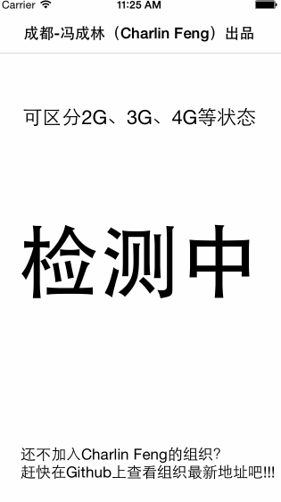

    Charlin出框架的目标：简单、易用、实用、高度封装、绝对解耦！

# CoreStatus
   网络状态监听者：可监听2G/3G/4G ！
 
  
框架截图   CUT
===============
 

   

  

组织信息 Charlin Feng：
===============
 
#### 特别群：请西部省市朋友实名加入组织。其他地区朋友请添加2-4群：谢谢。
 
【西部区域】西部大开发群号： 473185026  -追赶北上广！为振兴西部IT而努力！ 
热烈欢迎中国西部各省市的从事iOS开发朋友实名进群！本群为是聚集西部零散开发者，大家齐心协力共进退！   

【全国可加】四群： 347446259 
新开，可加！欢迎全国朋友加入组织   

【全国可加】三群： 474377358 
新开，可加！欢迎全国朋友加入组织   

【全国可加】二群： 369870753 
**WORNING: 已爆满，加不上了**  

【全国可加】一群：163865401 
**WORNING: 已爆满，加不上了**  

  

####注意：默认程序没有反应，你需要在真机手动改变网络环境才能看到效果！！！

  

框架特性： FEATURE
===============
>1.基于苹果的Reachability封装。 
>2.对常用网络状态封装了简单API。 
>3.作为解耦的重要目的，本框架是其他很多重要Core框架的核心成员。 
>4.新增对2G、3G、4G网络检测支持。 
>5.增加实时检测，并屏蔽了注册通知及细节，直接使用即可，简单方便！ 

   

使用说明 USAGE
===============
#### 1.导入框架

        #import "CoreStatus.h"

  
#### 2. 获取网络当前状态: 当前状态，非实时

        CoreNetWorkStatus currentStatus = [CoreStatus currentNetWorkStatus];
        
请注意当前状态是枚举，具体值如下：

        /** 网络状态 */
        typedef enum{
            
            /** 无网络 */
            CoreNetWorkStatusNone=0,
            
            /** Wifi网络 */
            CoreNetWorkStatusWifi,
            
            /** 蜂窝网络 */
            CoreNetWorkStatusWWAN,
            
            /** 2G网络 */
            CoreNetWorkStatus2G,
            
            /** 3G网络 */
            CoreNetWorkStatus3G,
            
            /** 4G网络 */
            CoreNetWorkStatus4G,
            
            /** 未知网络 */
            CoreNetWorkStatusUnkhow
        
        }CoreNetWorkStatus;

  
#### 3.当前状态中文说明文字：

    NSString * statusString = [CoreStatus currentNetWorkStatusString];

  
#### 4.实时监控：注册监听

    //调用一个方法即可
    [CoreStatus beginNotiNetwork:self];

请注意这个方法需要一个遵循了CoreStatusProtocol协议的对象，一般控制器遵循此协议：
然后请实现以下协议方法（optional）：

        -(void)coreNetworkChangeNoti:(NSNotification *)noti;
    

        注意：当网络改变，此协议方法会自行触发，我传了通知数据给你，示例有打印通知内容。
        当然，最简单的获取当前实时状态的方法是使用上面的静态状态获取，即：
        
        -(void)coreNetworkChangeNoti:(NSNotification *)noti{
            //因为这些是实时，所以每次的静态状态就是当前实时状态，你也可以从noti中取
            CoreNetWorkStatus currentStatus = [CoreStatus currentNetWorkStatus];
        }

  

#### 5.实时监控：移除监听
请特别注意：因为内部封装，所以你看不到监听过程，实际内部已经注册了通知。请注意用完需要关闭监听。
比如控制器不可见需要关闭监听：

    -(void)viewDidDisappear:(BOOL)animated{
        
        [super viewDidDisappear:animated];
        
        [CoreStatus endNotiNetwork:self];
    }

  
#### 6. 新增API：

        /** 是否是Wifi */
        +(BOOL)isWifiEnable;
        
        /** 是否有网络 */
        +(BOOL)isNetworkEnable;
        
        /** 是否处于高速网络环境：3G、4G、Wifi */
        +(BOOL)isHighSpeedNetwork;

  

致谢 THANKS
===============
感谢一号群成都iOS开发_Charlin（163865401，群已满）朋友深夜测试！！！感谢！

  
结束语 END
===============
其实有很多方法可以完成同样的事情，思路其实都是一样的。赶快投入组织的怀抱吧！
  

开源许可 License
===============
Charlin Feng的框架基于MIT license.您可点击License文件查看详情。
  
